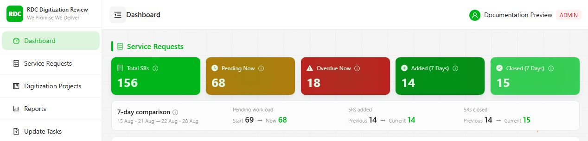
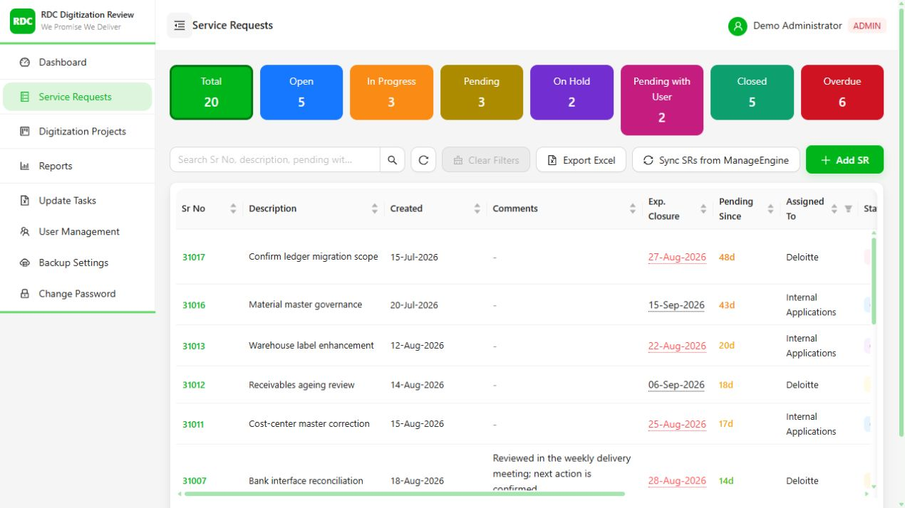
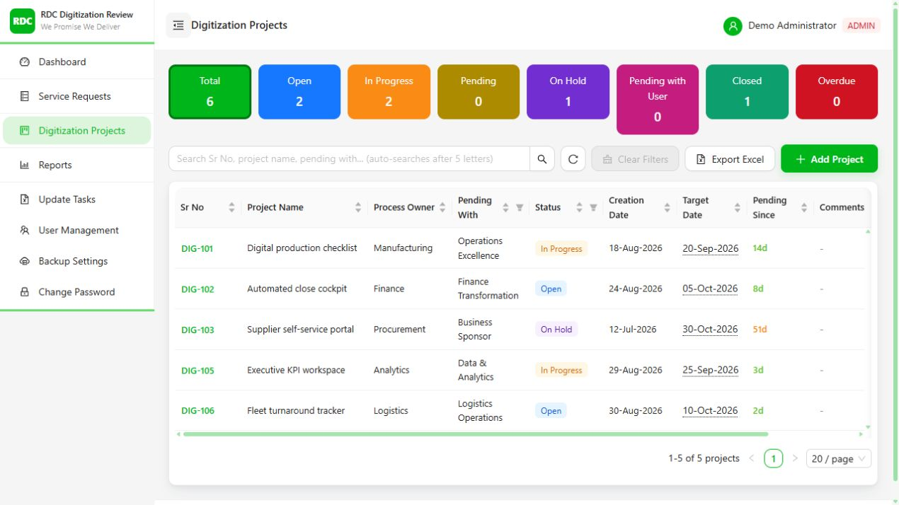
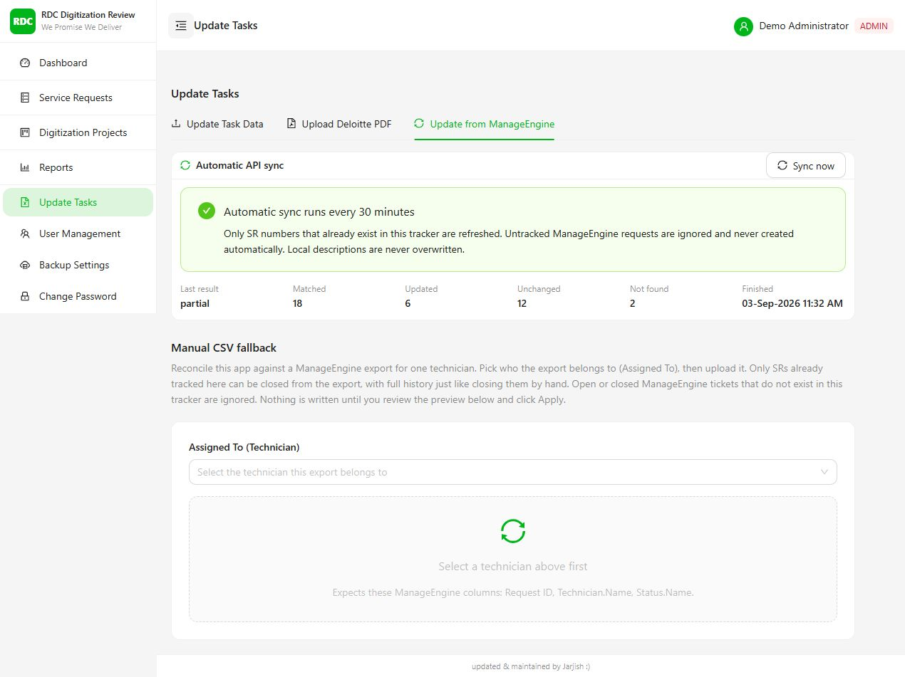
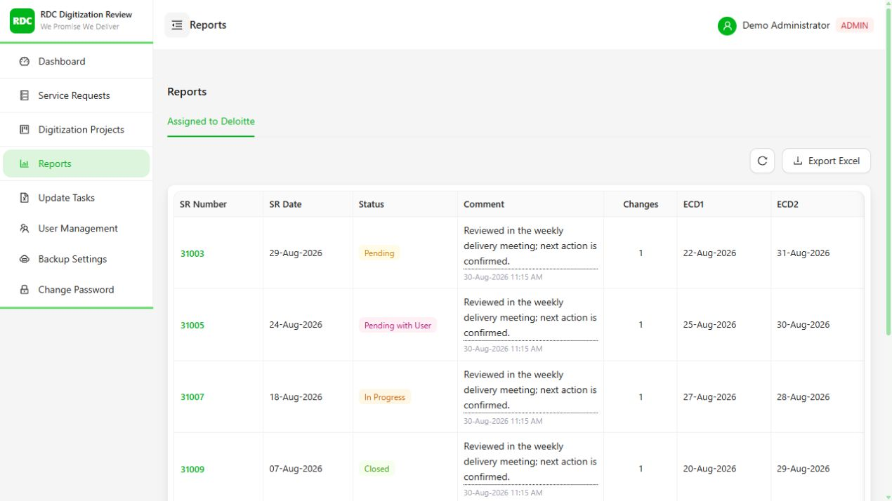
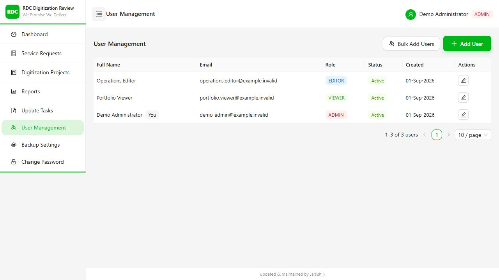
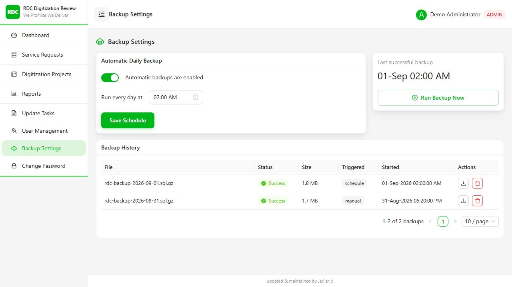
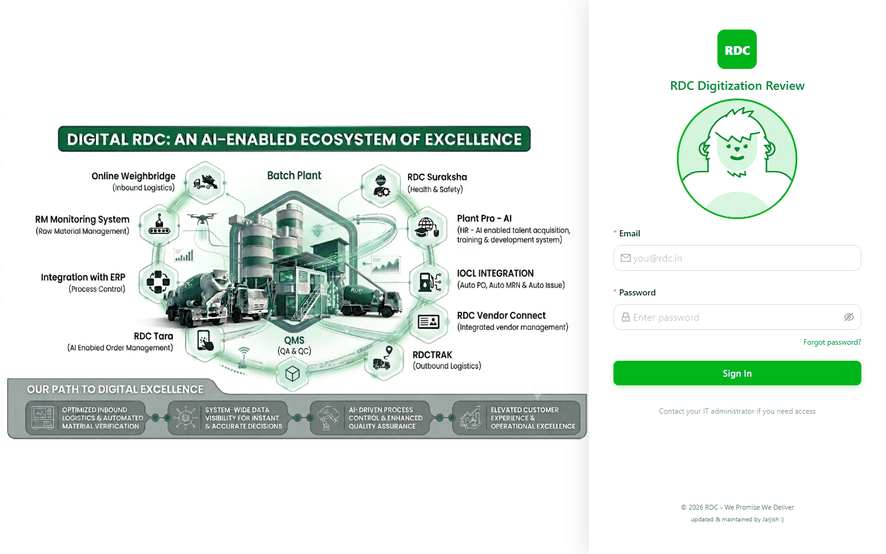
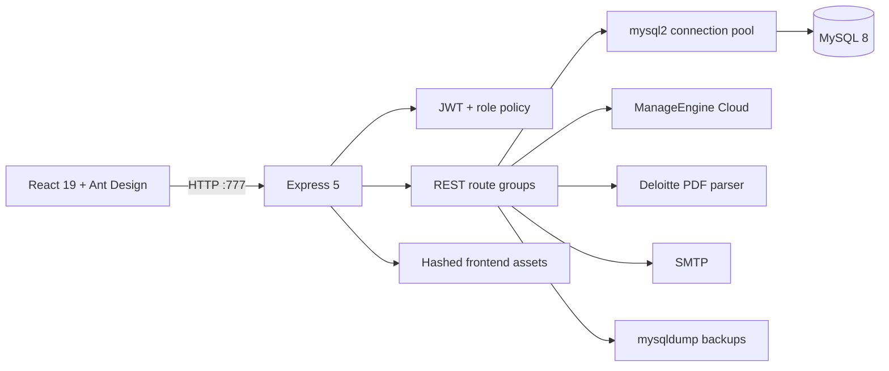
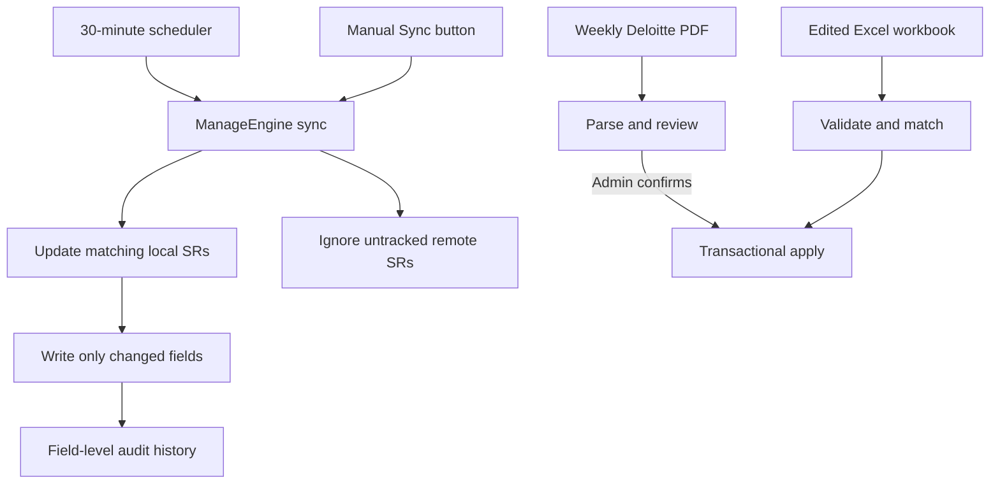

<p align="center">
  
</p>

<h1 align="center">RDC Digitization Review</h1>

<p align="center">
  A production-grade internal operations platform for Service Requests, digitization delivery,
  vendor coordination, audit history, and automated ManageEngine synchronization.
</p>

<p align="center">
  <a href="https://github.com/jarjishSiddibapa/rdc-erp-meeting-tracker/actions/workflows/ci.yml"></a>
  
  
  
  
</p>



> The screenshots in this repository were captured from the current production build using a
> temporary database containing fictional records. No production credentials, users, service
> requests, or operational figures are included.

## Why this project exists

RDC teams previously depended on separate status files, vendor reports, portal lookups, and
manual follow-ups to understand service delivery. This application provides one operational
source of truth for two related workstreams:

- **Service Requests** from creation through closure, ownership, comments, and overdue tracking.
- **Digitization Projects** with process owners, targets, status, and category-aware permissions.

It also connects those records to weekly Deloitte reporting, ManageEngine ServiceDesk Plus
Cloud, Excel-based bulk operations, role administration, and recoverable MySQL backups.

## Product capabilities

| Capability | What it delivers |
| --- | --- |
| Operational dashboard | Current workload, overdue exposure, rolling seven-day movement, formulas, and workload share by owner |
| Unified work tracking | Searchable, filterable, resizable tables for SRs and Digitization Projects with category-specific fields |
| ManageEngine automation | OAuth-based sync every 30 minutes, manual sync, guarded field mapping, and an update-only boundary for locally tracked SRs |
| Auditability | Field-level history, appended comments, soft deletion, diff-only updates, and transparent import previews |
| Controlled bulk updates | Download/edit/upload Excel round trip with separate SR and Digitization sheets and transactional writes |
| Deloitte workflow | Review-first weekly PDF parsing with deterministic multi-format ETA handling, highest-ETA duplicate resolution, source-period warnings, and per-row review reasons |
| Delivery reporting | Assigned-to-Deloitte report showing the full Expected Closure Date revision sequence |
| Administration | Admin/editor/viewer roles, optional Digitization edit permission, bulk user creation, password lifecycle, and scheduled backups |

The complete screen-by-screen inventory is in [Feature reference](docs/FEATURES.md).

## Product tour

### Work management

| Service Requests | Digitization Projects |
| --- | --- |
|  |  |

Status tiles double as filters. The primary tables support server-side pagination, search,
column filters, sorting, adjustable widths, Excel export, and direct access to a record's
detail, history, and discussion timeline.

### Controlled updates and delivery reporting

| Excel/PDF/ManageEngine workflows | Expected Closure Date history |
| --- | --- |
|  |  |

Imports separate preview from apply. Bulk writes are diffed, batched, and transactional, so an
unchanged upload reports zero updates and cannot generate misleading history noise.

### Administration and resilience

| User and role administration | Backup operations |
| --- | --- |
|  |  |

<details>
<summary><strong>Authentication experience</strong></summary>



The responsive sign-in flow includes password reset, session-scoped authentication, and a
lightweight interactive mascot without loading a WebGL runtime.

</details>

## Architecture



Production runs as **one long-lived Node process on one port**. Express serves both the REST API
and the built React application, avoiding a second frontend server or reverse-proxy requirement
for the standard LAN deployment.

### Integration flow



See [Architecture](docs/ARCHITECTURE.md) and [API reference](docs/API_REFERENCE.md) for the full
runtime, data-model, authorization, and endpoint details.

## Engineering highlights

### Correctness and trust

- Dashboard formulas are calculated server-side and exposed through information tooltips.
- `sr_history` records actual field changes only; no-op updates do not pollute the timeline.
- Bulk operations use batched lookups and real database transactions.
- Records and users use soft deletion, including protection against recreating intentionally
  deleted ManageEngine requests.
- Overdue logic is category-aware: SR Expected Closure Date versus Digitization Target Date.
- One active record per category/SR number is enforced by MySQL, not only by UI checks.
- Repeated Deloitte rows keep the uniquely highest valid ETA; unrankable ties are blocked
  instead of creating duplicates or choosing an arbitrary value.

### Performance on a shared server

| Optimization | Measured/resulting effect |
| --- | --- |
| Removed WebGL, Framer Motion, and duplicate HTTP runtime dependencies | Frontend JS reduced **35.6% raw** and **31.7% gzip** in the measured production build |
| Converted the login illustration to WebP | Brand artwork reduced from 2.18 MB to 119 KB (**94.6% smaller**) |
| Lazy PDF parser | Avoids roughly **20–25 MB** of resident memory during normal dashboard/SR usage |
| Idle and hover route warming | Feature screens are downloaded before the first intentional click when the connection allows it |
| Abortable table reads | Obsolete searches, filters, and page requests stop instead of competing with the current request |
| Batched metadata and DB work | Fewer HTTP requests, fewer SQL scans, and no N+1 import lookups |
| Conservative MySQL pool | Five connections and three idle slots by default for coexistence with other applications |

Heavy Excel code remains a click-time dynamic import. Hashed assets are immutable-cached, stable
public assets revalidate, and production logging omits routine static/health traffic.

### Security and operations

- JWT authentication with bcrypt password hashing and session-scoped browser storage.
- Admin/editor/viewer authorization plus a narrowly scoped Digitization edit permission.
- Helmet headers, controlled CORS, compressed responses, and rate-limited authentication routes.
- Secrets stay in the untracked `backend/.env`; OAuth authorization codes are exchanged by a
  purpose-built script that does not print the resulting refresh token.
- Automated and on-demand MySQL backups with download history and Task Scheduler recovery.
- Graceful shutdown, health endpoint, startup/build logs, and additive schema migrations.

## Technology

| Layer | Technology |
| --- | --- |
| Frontend | React 19, Vite 8, Ant Design 6, native Fetch, Day.js |
| Backend | Node.js, Express 5, `mysql2/promise` |
| Authentication | JWT, bcrypt, role/category authorization |
| Integrations | ManageEngine/Zoho OAuth, Deloitte PDF, Excel, SMTP |
| Operations | Windows Task Scheduler, `mysqldump`, Node test runner, GitHub Actions |

## Quick start

### Requirements

- Node.js `20.19+` or `22.12+`
- npm
- MySQL 8-compatible server
- Windows for the supported production workflow; development also works in PowerShell or Bash

### Local production-style run

```powershell
git clone https://github.com/jarjishSiddibapa/rdc-erp-meeting-tracker.git
cd rdc-erp-meeting-tracker
npm ci --prefix backend
npm ci --prefix frontend
Copy-Item backend\.env.example backend\.env
notepad backend\.env
npm run build --prefix frontend
npm start --prefix backend
```

Open <http://localhost:777>. Startup creates missing tables, runs additive migrations, and
seeds the configured administrator only when the database has no users.

For hot reload, run `start-backend.bat` and `start-frontend.bat` in separate terminals. For the
supported Windows production workflow, run `build.bat` and then `start-all.bat`.

## Configuration

Copy `backend/.env.example` to `backend/.env`. Configuration is grouped into:

- server/JWT settings;
- first-run administrator values;
- MySQL connection and pool limits;
- SMTP credentials;
- `mysqldump` location;
- optional ManageEngine OAuth and scheduler settings.

Never commit `.env`, refresh tokens, database dumps, backup archives, uploads, or runtime logs.
The complete OAuth procedure is documented in [ManageEngine synchronization](docs/MANAGEENGINE_SYNC.md).

## Quality gates

```powershell
npm run lint --prefix frontend
npm run build --prefix frontend
npm test --prefix backend
node --check backend/server.js
```

GitHub Actions runs dependency installation, lint, production build, backend tests, and focused
backend syntax checks on every push and pull request to `main`.

## Documentation

| Document | Audience and purpose |
| --- | --- |
| [Feature reference](docs/FEATURES.md) | Full product capability and permission matrix |
| [User guide](docs/USER_GUIDE.md) | Dashboard formulas and day-to-day workflows |
| [Architecture](docs/ARCHITECTURE.md) | Topology, data model, integrations, and design decisions |
| [API reference](docs/API_REFERENCE.md) | Endpoint groups, authorization, parameters, and response conventions |
| [ManageEngine sync](docs/MANAGEENGINE_SYNC.md) | OAuth, mappings, scheduler behavior, and production checks |
| [Production runbook](PRODUCTION.md) | Windows installation, Task Scheduler, updates, health checks, and rollback |
| [Development guide](docs/DEVELOPMENT.md) | Local workflows, migrations, conventions, and verification |
| [Troubleshooting](docs/TROUBLESHOOTING.md) | Startup, MySQL, cache, email, port, and backup recovery |
| [Security policy](SECURITY.md) | Data boundaries, secret handling, and vulnerability reporting |
| [Contributing](CONTRIBUTING.md) | Branch, review, documentation, and validation expectations |

## Repository map

```text
backend/             Express API, schema/migrations, sync, imports, backups
frontend/            React client and production build configuration
docs/                Product, architecture, API, development, and operations guides
graphify-out/        Maintained codebase knowledge graph
.github/workflows/   Continuous integration
build.bat            Reproducible dependency install and frontend build
start-all.bat        Production single-port launcher
update-production.bat Safe fast-forward production update
```

## License and data boundary

This is internal business software and is not licensed for public redistribution. Screenshots
and examples use fictional data. Production data, credentials, logs, backups, and user details
must remain within RDC's approved systems and access controls.
