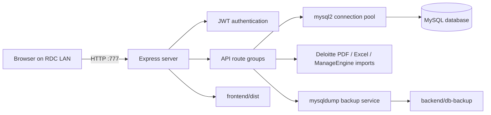

# Architecture

## Runtime topology

The backend is the production entrypoint. It serves the API and the built SPA from one process, which keeps the LAN deployment small and avoids running a Vite development server in production.

## Repository responsibilities

| Area | Responsibility |
| --- | --- |
| `backend/server.js` | Middleware, route mounting, static frontend serving, startup/shutdown, health check |
| `backend/db/database.js` | Table creation, additive migrations, default administrator seeding |
| `backend/routes/srs.js` | SR and Digitization CRUD, filters, comments, history, category-aware authorization |
| `backend/routes/stats.js` | Dashboard totals, rolling seven-day metrics, pending-by-person aggregation |
| `backend/routes/csv-import.js` | Excel parse/apply and diffed field updates |
| `backend/routes/deloitte-import.js` | Deloitte PDF parse/apply workflow |
| `backend/routes/manageengine-import.js` | ManageEngine API sync status/manual run and CSV fallback workflow |
| `backend/services/manageengine-sync.js` | OAuth token refresh, 30-minute schedule, field mapping, audit-safe updates |
| `backend/services/backup.js` | Scheduled and manual `mysqldump` backups |
| `frontend/src/App.jsx` | Public/protected routes and application shell |
| `frontend/src/pages/` | Feature screens |
| `frontend/src/services/api.js` | Client API wrappers |

The detailed route catalogue is maintained in [API reference](API_REFERENCE.md).

## Data model

The primary `srs` table stores both categories using `category = 'SR'` or `category = 'Digitization'`. Related tables record users, field-level history, and comments. Records are soft-deleted with `is_deleted`; normal application flows never hard-delete SRs or users.

The `sr_history` table is also used to reconstruct dashboard snapshots. For the start-of-period pending figure, the stats route finds the latest status change before the boundary, falls back to the first change after it, and finally uses the current status. This keeps “start” and “now” comparable when a record was closed and later reopened.

## Authentication and authorization

Login returns a JWT containing the user id, role, display name, and Digitization edit flag. The frontend stores the token in `sessionStorage`, so closing the browser tab signs the user out. Backend middleware verifies the token; route handlers apply role and category checks.

## API map

All protected routes require `Authorization: Bearer <token>` unless noted.

| Group | Endpoints | Purpose |
| --- | --- | --- |
| Auth | `/api/auth/login`, `/me`, `/change-password`, `/forgot-password`, `/reset-password` | Sessions and password lifecycle |
| Records | `/api/srs`, `/api/srs/:id`, `/comments`, `/close`, `/reopen`, `/stats/summary` | SR and Digitization operations |
| Dashboard | `/api/stats/dashboard` | Current and comparison metrics |
| Users | `/api/users` and `/bulk` | Admin user management |
| Imports | `/api/csv-import/execute`, `/api/deloitte-import/{parse,apply}`, `/api/manageengine-import/{parse,apply,sync-status,sync-now}` | Bulk update and synchronization pipelines |
| Reporting | `/api/reports/assigned-to-ecd` | Deloitte assignment/ECD history |
| Backups | `/api/backup/settings`, `/run-now`, `/history`, `/download/:filename` | Backup administration |
| Health | `/api/health` | Unauthenticated process check |

## Performance and operational choices

- The MySQL pool defaults to five connections with three idle connections, and can be tuned
  with `DB_POOL_SIZE`, `DB_POOL_IDLE`, and `DB_POOL_IDLE_TIMEOUT_MS` for a shared host.
- Frontend routes are lazy-loaded, warmed during browser idle time, and warmed on menu hover.
  Excel support remains a click-time dynamic import.
- The native Fetch client coalesces identical safe reads, briefly caches stable metadata, and
  cancels obsolete SR table requests when filters or pages change.
- SR filter choices come from one batched endpoint instead of three independent requests.
- The Deloitte PDF parser is required on demand, avoiding its substantial memory cost during
  normal dashboard and SR usage.
- Hashed frontend assets receive immutable caching. Public brand assets receive a shorter
  revalidation cache, while `index.html` remains uncached so deployments appear promptly.
- Production logging skips static assets and repeated health checks; SMTP verification runs
  after the HTTP listener starts.
- Compression, Helmet, CORS restrictions, and auth rate limits are enabled in Express.
- The scale target is tens to low hundreds of records and a handful of concurrent users, so maintainability and clear audit behavior take priority over distributed-system complexity.

### Why Express remains the backend

The application is primarily MySQL and third-party-API bound. Rewriting the same routes in
FastAPI would add migration and dual-stack operational risk without removing database or
network latency. The single Node process also serves the built frontend, scheduled work, and
API from one small deployment. Targeted request, bundle, pool, and lazy-loading improvements
therefore provide a better performance-to-risk result than changing backend languages.

## Key design decisions

| Decision | Reason | Trade-off |
| --- | --- | --- |
| One `srs` table for both categories | Shared history, comments, imports, and authorization paths | Every query must remain category-aware |
| Single-port Node deployment | One service to operate on the Windows host | Backend restart is required after frontend builds |
| JWT permissions in session storage | Simple LAN session model; closing the tab signs out | Role changes require a new login |
| Preview then apply for imports | Users can inspect parser/match quality before mutation | Two-step workflow is intentionally slower than blind import |
| Diff-only field writes | Accurate history and meaningful update counts | Mapping code must compare normalized values carefully |
| Soft deletion | Preserves audit intent and prevents remote recreation | Storage is retained until an explicit maintenance decision |
| Native Fetch plus focused caching | Smaller client runtime and fewer duplicate reads | Cache windows stay deliberately short |
| Express rather than a FastAPI rewrite | Workload is DB/API bound and the current stack is operationally compact | Node remains the backend language |
