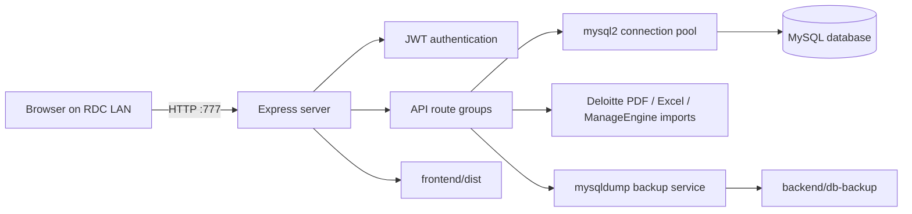

# Architecture

## Runtime topology

The backend is the production entrypoint. It serves the API and the built SPA from one process, which keeps the LAN deployment small and avoids running a Vite development server in production.

## Repository responsibilities

| Area | Responsibility |
| --- | --- |
| `backend/server.js` | Middleware, route mounting, static frontend serving, startup/shutdown, health check |
| `backend/db/database.js` | Table creation, additive migrations, default administrator seeding |
| `backend/routes/srs.js` | SR and Digitization CRUD, filters, comments, history, category-aware authorization |
| `backend/routes/stats.js` | Dashboard totals, rolling seven-day metrics, pending-by-person aggregation |
| `backend/routes/csv-import.js` | Excel parse/apply and diffed field updates |
| `backend/routes/deloitte-import.js` | Deloitte PDF parse/apply workflow |
| `backend/routes/manageengine-import.js` | ManageEngine CSV parse/apply workflow |
| `backend/services/backup.js` | Scheduled and manual `mysqldump` backups |
| `frontend/src/App.jsx` | Public/protected routes and application shell |
| `frontend/src/pages/` | Feature screens |
| `frontend/src/services/api.js` | Client API wrappers |

## Data model

The primary `srs` table stores both categories using `category = 'SR'` or `category = 'Digitization'`. Related tables record users, field-level history, and comments. Records are soft-deleted with `is_deleted`; normal application flows never hard-delete SRs or users.

The `sr_history` table is also used to reconstruct dashboard snapshots. For the start-of-period pending figure, the stats route finds the latest status change before the boundary, falls back to the first change after it, and finally uses the current status. This keeps “start” and “now” comparable when a record was closed and later reopened.

## Authentication and authorization

Login returns a JWT containing the user id, role, display name, and Digitization edit flag. The frontend stores the token in `sessionStorage`, so closing the browser tab signs the user out. Backend middleware verifies the token; route handlers apply role and category checks.

## API map

All protected routes require `Authorization: Bearer <token>` unless noted.

| Group | Endpoints | Purpose |
| --- | --- | --- |
| Auth | `/api/auth/login`, `/me`, `/change-password`, `/forgot-password`, `/reset-password` | Sessions and password lifecycle |
| Records | `/api/srs`, `/api/srs/:id`, `/comments`, `/close`, `/reopen`, `/stats/summary` | SR and Digitization operations |
| Dashboard | `/api/stats/dashboard` | Current and comparison metrics |
| Users | `/api/users` and `/bulk` | Admin user management |
| Imports | `/api/csv-import/execute`, `/api/deloitte-import/{parse,apply}`, `/api/manageengine-import/{parse,apply}` | Bulk update pipelines |
| Reporting | `/api/reports/assigned-to-ecd` | Deloitte assignment/ECD history |
| Backups | `/api/backup/settings`, `/run-now`, `/history`, `/download/:filename` | Backup administration |
| Health | `/api/health` | Unauthenticated process check |

## Performance and operational choices

- The MySQL pool batches work and avoids per-row queries in bulk paths.
- Frontend routes are lazy-loaded and Excel support is dynamically imported.
- Compression, Helmet, CORS restrictions, and auth rate limits are enabled in Express.
- The scale target is tens to low hundreds of records and a handful of concurrent users, so maintainability and clear audit behavior take priority over distributed-system complexity.
